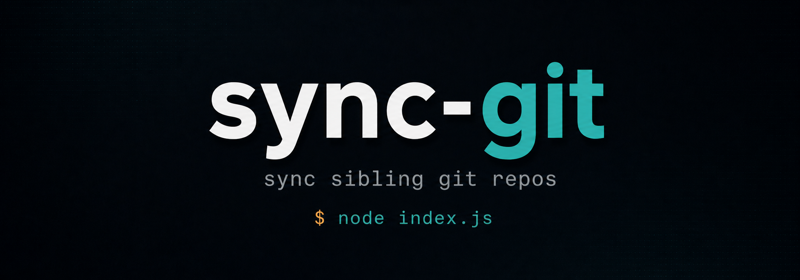

<p align="center">
  
</p>

# pull-all

`pull-all` 是一個零相依的 Node.js CLI，用來檢查同一層目錄下的多個 git repo，並只對落後遠端的 repo 執行 `git pull`。

## 為什麼做這個

使用 Codex 時常會同時維護多個專案，每次都要逐一進到各個 repo 執行 `git pull` 很麻煩。`pull-all` 讓你在一個地方檢查同層專案的更新狀態，先確認哪些 repo 落後遠端，再決定是否一次更新。

## 特色

- 一次檢查兄弟層所有 git repo
- 執行 `git fetch` 後先顯示狀態，不會直接 pull
- 只針對 behind 的 repo 詢問是否更新
- `init` 指令：互動式勾選 repo，自動寫入 `.env`
- `clone` 指令：自動 clone `.env` 列了但本機沒有的 repo（透過 `gh` CLI）
- 可用 `.env` 指定要同步的 repo 清單
- 無 npm dependencies，只需要 Node.js 與 git（`clone` 子命令另需 `gh`）

## 安裝

將此 repo 放在要管理的專案同層：

```text
~/code/
  pull-all/
  web/
  common/
  note/
```

確認環境已安裝：

```bash
node --version
git --version
```

建立全域指令（建議）：

```bash
npm link
```

## 使用方式

`pull-all` 以「當前工作目錄的父目錄」為掃描根目錄，因此可在 code 目錄底下任一 repo 內執行：

```bash
cd ~/code/web
pull-all
# 掃 ~/code/ 底下的兄弟 repo
```

或直接在 code 目錄底下：

```bash
cd ~/code/pull-all
pull-all
# 一樣掃 ~/code/ 底下
```

未 `npm link` 也可：

```bash
node ~/code/pull-all/index.js   # 仍以 cwd 父目錄為準
npm start                        # 在 pull-all/ 目錄內
```

### 用 `PULL_ALL_ROOT` 明確指定根目錄

從任意位置都想固定掃同一坨 repo（如 CI、cron、跨機 dotfiles），用 `PULL_ALL_ROOT` 直接指定根目錄（**不取父目錄**，掃這個目錄底下的子資料夾）：

```bash
PULL_ALL_ROOT=~/code pull-all
PULL_ALL_ROOT=/srv/projects pull-all
```

執行時頂部會印出實際解析的 root 路徑，方便確認沒走錯地方。

## 設定

`.env` 寫在 **pull-all repo 根目錄**（與 `.env.example` 同位置），與「掃描根目錄」解耦。不論在哪個 cwd 呼叫，工具都從同一處讀寫 `.env`。

### 快速初始化（建議）

執行 `init` 指令，互動式勾選要追蹤的 repo，自動寫入 pull-all repo 根目錄下的 `.env`：

```bash
node index.js init
# 或
npm run init
```

```text
選擇要追蹤的 repo（↑↓ 移動，Space 切換，Enter 確認）：

  [x] web
  [x] common
  [ ] old-project
```

若 `.env` 已存在，會自動預選現有清單，方便修改。

### 手動設定

同步清單屬於本機設定，請放在 `.env`，不要提交到 git。

```env
PULL_ALL_INCLUDE=web,common,note
```

| 設定 | 行為 |
| --- | --- |
| 有 `PULL_ALL_INCLUDE` | 只檢查清單內的 repo |
| 無 `.env` 或 `PULL_ALL_INCLUDE` 為空 | 檢查父目錄下所有 git repo |
| 清單內 repo 不存在 | 顯示警告，其他 repo 照常執行（用 `pull-all clone` 補回） |
| 清單內目錄不是 git repo | 跳過該目錄 |
| `PULL_ALL_OWNER` | `pull-all clone` 使用的 GitHub owner（個人或 org 帳號），未設定時 `clone` 會報錯 |

也可以臨時用 shell 環境變數覆蓋 `.env`：

```bash
PULL_ALL_INCLUDE=web,common node index.js
```

## 執行流程

1. 掃描根目錄（`PULL_ALL_ROOT` 或 cwd 父目錄）下的 repo，套用 `PULL_ALL_INCLUDE` 白名單。
2. 對每個 repo 執行 `git fetch`。
3. 用 `git rev-list HEAD..@{u} --count` 判斷是否落後追蹤分支。
4. 列出狀態摘要。
5. 只有存在 behind repo 時，才詢問是否執行 `git pull`。

## 輸出範例

```text
root: /Users/barney/code
正在檢查 3 個 repo 狀態...

  web     up to date
  common  2 commits behind
⚠ note    無追蹤分支

1 個 repo 需要更新，要 pull 嗎？[y/N] y

✓ common
```

## 補回缺漏 repo（`pull-all clone`）

`.env` 列了但本機沒有的 repo，可用 `pull-all clone` 自動補回。URL 解析、認證、protocol 全部交給 `gh` CLI 處理。

前置條件：

- 已安裝 [gh CLI](https://cli.github.com/)
- 已執行 `gh auth login`
- `.env` 設定 `PULL_ALL_OWNER`（GitHub 個人或 org 帳號）

```env
PULL_ALL_INCLUDE=web,common,note
PULL_ALL_OWNER=barney
```

```bash
node index.js clone
# 或
pull-all clone
```

流程：

1. 檢查 `gh` 已安裝且已登入，任一失敗即報錯結束。
2. 讀 `PULL_ALL_OWNER` 與 `PULL_ALL_INCLUDE`。
3. 比對掃描根目錄，對本機不存在的名字並行執行 `gh repo clone <OWNER>/<name>`。
4. 已存在但不是 git repo 的目錄會跳過警告，不覆蓋既有檔案。

限制：

- 目前僅支援單一 owner，名字含 `/` 會直接報錯。
- 只支援 GitHub。GitLab、Bitbucket、自架 Gitea 不在範圍。
- 主 `pull-all` 與 `pull-all init` 不受影響，不需要 `gh`。

## 常用指令

```bash
# 初始化 .env（互動式勾選）
node index.js init
npm run init

# 補回 .env 列了但本機沒有的 repo
node index.js clone

# 執行同步
node index.js
npm start

# 只同步指定 repo（臨時覆蓋）
PULL_ALL_INCLUDE=web,common node index.js
```

## 遷移指引

中間有段時間（`resolve-paths-from-cwd` 之後）`.env` 預期放在「掃描根目錄」（cwd 父目錄或 `PULL_ALL_ROOT`）。現已**改回 pull-all repo 根目錄**，與 `.env.example` 位置一致。從 pull-all repo 內執行：

```bash
mv ../.env .env
```

### 為何 revert

- 當初把 `.env` 搬離 repo 的主要動機是「`npm link` 全域安裝後 `__dirname` 會指向 npm global lib」——查證為**誤判**。`npm link` 走 symlink，Node 預設 resolve symlink，`__dirname` 仍是 source repo。只有 `npm install -g`（從 registry 真實複製檔案）才會落到 global lib，本專案無 publish 計畫。
- `.env.example` 留在 repo 內、`.env` 卻在外面，clone 後第一直覺就會踩到。位置一致才是主訴求。
- `PULL_ALL_ROOT` 與 `.env` 位置現在完全解耦：仍可設 `PULL_ALL_ROOT=/some/path` 掃別處，但 `.env` 永遠跟著工具走。

## 授權

MIT
